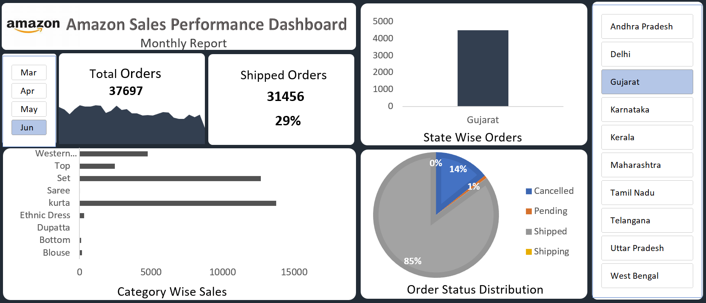

# 📊 Amazon Sales Performance Dashboard(Excel)

An interactive Sales Performance Dashboard built using Microsoft Excel to analyze Amazon order data and generate meaningful business insinghts.

---

## 🔍 Project Overview
This project transforms raw Amazone sales data into a structured and interactive dashboard using Excel.

The dashboard enable dynamic filtering and real-time KPI tracking to monitor sales performance across dofferent months, states, categories, and order statuses.

---

## Dashboard Preview 

## 📊Key Insights $ KPIs
The dashboard tracks:
- **Total Orders**

- **Shipped Orders**

- **Order Fulfillment Rate (%)**

- **Monthly Sales Trend**

- **Category-wise Sales Performance**

- **State-wise Order Distribution**

- **Order Status Breakdown(Shipped, Cancelled, Pending, Shipping)**
---
## Interactive Featuares
- Month-wise Slicer (Mar-Jun)

- State-wise Filtering Panek

- Dynamic KPI Cards

- Pivot-based Charts

- Automatic Percentege Calculation 

- Clean Business Dashboard Layout

---

## 📉Charts Used
- Area Chart - Monthly Sales Trend 

- Horizontal Bar Chart - Category-wise Sales

- Column Chart - State-wise Orders

- Pie Chart - Order Status Distribution

---
## 🛠️Tools & Techniques Used

- Microsoft Excel 

- Pivot Tables

- Pivot Charts 

- Slicers

- KPI Calculations 

- Percentage Analysis 

- Data Cleaning 

- Dashboard Design & Formatting
---

## 💡Business Value
This dashboard help in:
- Identifying top-performing product catagories

- Monitoring fulfillment performance 

- Comparing state-level sales contribution

- Analyzing order status distribution 

- Tracking monthly sales trends
---
## 🎯Objective
To demonstrate the ability to convert raw sales data into an interactive and business-ready dashboard using Excel.

---

## 👩🏻‍💻Author
**Nency Purohit**
